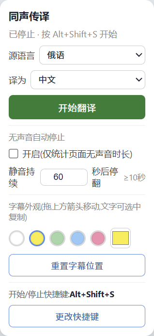

# AI 同声传译助手(火山引擎版)

把单向外语音频流实时翻译成**中文滚动字幕**(可选 TTS 语音)的助手。核心难点是**低延迟**与**自动纠正此前的识别/翻译错误**。

> 当前进度:里程碑 9(收尾)—— 完整演示脚本与使用文档。项目主体功能(ASR → 翻译 → 中文滚动字幕 → 纠错 → 可选 TTS)已全部打通。

## 架构

```
┌──────────────────────────── Chrome 扩展 (MV3) ────────────────────────────┐
│  content.js(桌宠控制台) ──start/stop──▶ background.js ──▶ offscreen.js       │
│       │ 拖动/改色/选语言                              │                  │
│       ▼                                               │                  │
│  页面底部滚动字幕 overlay ◀── subtitle ── background ◀─┘                  │
│                                       tabCapture 音频 ──▶ AudioWorklet      │
│                                       重采样 16k/16bit/单声道 PCM,~100ms 分片 │
└─────────────────────────────────────────────────────────┼──────────────────┘
                                                           │ WebSocket /ws
                                                           ▼
┌──────────────────────────────── Go 后端中继 ─────────────────────────────┐
│  server  ──PCM──▶ 火山 ASR(流式)──partial/final/修订──▶ 分句               │
│            ──原文──▶ 方舟翻译(Ark, OpenAI 兼容)──译文──▶ 回填 segment_id     │
│            ──纠错:(a) ASR 修订重译  (b) 周期性 LLM 复审──▶ 原地更新           │
│            ──(可选)译文──▶ 火山 TTS 双向流式 V3 ──音频──▶ 前端播放            │
└────────────────────────────────────────────────────────────────────────┘
```

### 目录结构

```
.
├── backend/                  # Go 后端(WebSocket 中继 + 纠错逻辑)
│   ├── main.go
│   ├── go.mod
│   └── internal/
│       ├── config/           # ★ 所有密钥与可调参数写死在此(不读环境变量)
│       ├── logging/          # 结构化日志(记录 X-Tt-Logid)
│       ├── asr/              # 火山 ASR 流式客户端(二进制协议)
│       ├── translate/        # 方舟翻译、分句策略、术语表、语种路由
│       ├── tts/              # 火山 TTS 双向流式 V3(连接复用)
│       └── server/           # WebSocket 中继、会话、纠错调度
└── extension/                # Chrome/Edge 扩展 (Manifest V3)
    ├── manifest.json
    ├── background.js         # Service Worker:抓音授权、状态、消息转发
    ├── offscreen.html/.js    # 音频采集 + WebSocket 推流 + TTS 播放
    ├── audio-worklet.js      # 16kHz PCM 重采样 + VAD(里程碑 2)
    ├── content.js + overlay.css  # 桌宠控制台 + 滚动字幕 overlay
    └── popup.html/.js        # 遗留弹窗页(未挂 default_popup;主入口为扩展图标/快捷键 + 桌宠)
```

## 配置(写死,不用环境变量)

所有密钥与参数都在 `backend/internal/config/config.go`(从 `config.go.example` 复制后填写),以常量/包级变量形式写死:

- **ASR**:`ASRAppKey`、`ASRAccessKey`、`ASRResourceID=volc.bigasr.sauc.duration`
- **TTS**:与 ASR 共用鉴权,`TTSResourceID=volc.service_type.10029`、`TTSVoiceType`
- **翻译(方舟 Ark)**:`ArkAPIKey`、`ArkModel`、`ArkEndpoint`
- **纠错策略**:`Correction`(开关、`ReviewContextWindow=5`、`ReviewInterval=1.2s` 等;每句定稿也会立即触发复审)
- **术语表 / 领域提示词**:`Prompt`(`Domain` 领域背景 + `Glossary` 术语对照,默认空)
- **重连**:`Reconnect`(指数退避)

> ⚠️ 运行前请把 `PLEASE_FILL_*` 占位符替换为控制台中的真实值。

## 如何跑

### 后端

```bash
cd backend
go mod tidy        # 拉取 gorilla/websocket、google/uuid
go run .           # 监听 0.0.0.0:8765,WS 路径 /ws,健康检查 /healthz
```

健康检查:

```bash
curl http://localhost:8765/healthz
```

### 前端扩展

1. Chrome 或 Edge 打开 `chrome://extensions` / `edge://extensions/`,开启「开发者模式」。
2. 「加载已解压的扩展程序」,选择本仓库的 `extension/` 目录。
3. 打开任意带音频的标签页。**每个新标签页第一次**开始翻译,需先点工具栏**扩展图标**或按快捷键(默认 `Alt+Shift+S`);授权后同一页可用桌宠「开始/停止」。

点击「开始」后:offscreen 连上后端 `ws://localhost:8765/ws`,发送 `start`(含源/目标语言与音频参数),并用 AudioWorklet 把标签页音频重采样为 16kHz/16bit/单声道 PCM、按 ~100ms 分片以二进制帧持续发送;断线会指数退避自动重连。后端日志(`audio received`)会打印累计帧数、字节数与按 16kHz 估算的音频时长,可据此核对采样率是否正确。

> 翻译(里程碑 4):每当一句被 ASR 定稿(final),后端会带上最近 `Translate.ContextWindow` 段「原文 => 译文」作为上下文,异步调用方舟(Ark)翻译,再以相同 `segment_id` 下发一条带 `target` 的 `subtitle` 事件原地回填译文。**需要先把 `config.go` 中的 `ArkAPIKey` 与 `ArkModel` 填成真实值**,否则后端会打印 `translation disabled` 警告并只显示原文。

> 字幕 UI(里程碑 5):页面底部**只显示中文译文**,以 `segment_id` 为键原地更新——
> 说话中 partial 逐字追加在末尾;定稿后稳定显示并随新句向上滚动累积(左对齐、底部锚定、可拖动/锁定/选中复制);
> 被自动纠正的句子以**绿色底色长亮**标记。仅在「停止翻译」时清空字幕。

> 语音(里程碑 7,可开关):在 `config.go` 中把 `TTS.Enable` 置为 `true` 并把
> `TTSVoiceType` 填成真实中文音色后,后端会在每句译文定稿(以及被复审纠正)时,
> 用「大模型语音合成 双向流式 V3」合成音频,经 WS 以 `tts_audio`(base64)下发,
> 前端 offscreen 用 Web Audio 顺序播放。**默认关闭**;未配置音色时仅打印一次性提示、不影响字幕。

> 术语表 / 延迟与重连(里程碑 8):
> **① 术语表 / 领域提示词**:在 `config.Prompt` 中填 `Domain`(领域/场景背景)与
> `Glossary`(原文词条 => 指定译法),二者会注入到翻译与复审的系统提示词中——
> 领域背景帮助模型消歧,术语表强制锁定人名/产品名/专业术语的统一译法(术语按字典序输出,
> 提示词稳定可测)。默认两者为空,不改变既有翻译行为。
> **② 延迟优化(TTS 持久连接复用)**:此前每句译文都新建一条 WS 连接并做连接级
> `StartConnection` 握手;现在改为整条会话复用同一连接,仅首句(或重连后)握手一次,
> 之后每句只跑会话级 `StartSession→…→SessionFinished`,省去逐句建连/握手的往返
> (联机实测:首句约 1.06s,后续句降到约 0.72s)。连接被服务端因空闲关闭时,下一句会自动重连重试。
> **③ 断线重连**:前端 `offscreen.js` 与后端 ASR 上游均已实现指数退避自动重连
> (参数见 `config.Reconnect`),断开期间丢弃实时音频帧以保持低延迟、避免积压。

> 纠错(里程碑 6):两层纠错都在 `config.Correction` 中开关与调参。
> **① ASR 修订重译**:当 ASR 对某条已定稿、已翻译的分句又返回了不同原文时,后端判定为「修订」,自动重新翻译并以同 `segment_id` 原地替换;**② 周期性 LLM 复审**:每句定稿后立即复审,并以 `ReviewInterval`(默认 1.2s)定时兜底;取最近 `ReviewContextWindow`(默认 5)段「原文+译文」整体送 LLM,借**后文澄清前文**校正早先译文。两种纠错回填时都带 `corrected` 标记,前端以**绿色底色**长亮提示「这句刚被更新」。

> 多语种策略:英/日/韩/法/德/俄等→中在 `translate/segment.go` 中**按语种独立参数**,互不影响:
> | 语种 | 切句与预览 | 定稿翻译 |
> |---|---|---|
> | **英语** | 整句单条,预览节流 250ms | 定稿走 Pro 完整翻译(已验收基线,不秒升预览) |
> | **日语** | 整句单条,35ms 预览跟嘴 | 定稿秒升预览,**跳过**后台 Pro 精修(最低延迟) |
> | **韩语** | 整句单条,60ms 预览跟嘴 | 定稿秒升预览 + 后台 Pro 精修 |
> | **法语/德语** | 整句单条,100ms 预览跟嘴 | 定稿秒升预览 + 后台 Pro 精修 |
> | **俄语** | 整句单条,90ms 预览跟嘴 | 定稿秒升预览 + 后台 Pro 精修 |
> | **西班牙语** | 整句单条,预览节流 250ms(沿用欧美默认) | 定稿走 Pro 完整翻译 |
> 小语种走专用 ASR 路由与更快判停。桌宠支持**语言热切换**(翻译进行中改源/目标语立即生效)。

## 成品预览(运行成功截图)

以下为**实际运行**界面(俄→中示例):桌宠控制台(含 `≥10秒` 静音下限提示) + 扩展已加载 + 页面底部**滚动累积中文字幕**。快捷键以浏览器扩展快捷键页为准(默认 `Alt+Shift+S`)。

| 滚动字幕(视频页) | 扩展已加载 | 桌宠控制面板 |
|---|---|---|
|  |  |  |

- **桌宠**:选源/目标语言、开始/停止、字幕颜色、快捷键(默认 `Alt+Shift+S`);**无声音自动停止**(可选,静音持续 ≥10 秒后自动停翻)。
- **字幕条**:只显示中文,左对齐、底部锚定、向上滚动累积;可拖动/锁定/选中复制;纠错句绿色长亮;停止翻译时才清空。
- **多语种**:英/日/韩/法/德/俄→中独立策略;语言热切换;详见上文「多语种策略」。

## demo演示视频
链接：https://www.bilibili.com/video/BV1VNEt6EEcG/?vd_source=562d8362e1f05caf7ba8c37f046ed36f#reply116707397995457
## 如何演示(演示脚本)

下面是一套可照着念的 5 分钟现场演示流程。

### 0. 演示前准备(开场前完成)
1. 复制 `backend/internal/config/config.go.example` 为 `config.go`,填好真实密钥;需要听语音再把 `TTS.Enable=true` 且填好 `TTSVoiceType`。
2. 启动后端:
   ```bash
   cd backend && go run .
   ```
   看到日志 `websocket relay listening addr=0.0.0.0:8765 ws_path=/ws` 即就绪;
   可另开一个终端 `curl http://localhost:8765/healthz` 看到 `{"status":"ok"}` 确认存活。
3. Chrome 或 Edge 加载扩展(`chrome://extensions` / `edge://extensions` → 开发者模式 → 加载已解压的扩展程序 → 选 `extension/`)。主入口为**扩展图标/快捷键 + 桌宠**;`popup.html` 为遗留文件,未在 `manifest.json` 挂 `default_popup`。
4. 打开一个**有外语音频**的标签页(英文演讲 / 播客 / 视频),先**手动播放**确认有声音;页面右下角会出现**桌宠**。

### 1. 开场(15 秒)
> 「这是一个 Chrome 扩展 + Go 后端的实时同声传译助手:它抓取当前标签页的外语音频,
> 实时转写、翻译成中文滚动字幕,并能自动纠正先前的识别/翻译错误,还可选朗读译文。」

### 2. 点开始,展示实时字幕(1.5 分钟)
1. **本页第一次**:先点扩展图标或按快捷键(如 `Alt+Shift+S`)开始;之后可展开**桌宠**选语言并用「开始/停止」。
2. 让音频继续播放,引导观众看页面底部**滚动字幕条**:
   - 说话中:译文逐字追加、旧句向上滚出视野;
   - 定稿:当前句稳定显示,下一句接在底部;
   - 纠错:被更新的句子**绿色高亮**长亮标记。
3. 切到后端终端,指出结构化日志:客户端连接、`asr handshake`(含 `x_tt_logid`)、音频帧统计、`translation backfilled`。

### 3. 展示纠错能力(1.5 分钟,本项目亮点)
> 「实时场景里前文常被后文澄清,所以我做了两层纠错——」
1. **ASR 修订重译**:当 ASR 对已定稿句子返回修订原文时,自动重译并原地替换;
2. **周期性 LLM 复审**:每句定稿即复审,并以约 1.2s 间隔定时兜底,借后文校正前文的人名/术语/歧义。
3. 两种纠错回填时,该句字幕会**绿色高亮**,提示「这句刚被更新」——现场指给观众看。

### 4. (可选)展示语音播报(30 秒)
- 若已开启 TTS:每句定稿/被纠正的译文会用火山「双向流式 V3」合成中文语音,前端顺序播放。
- 强调延迟优化:整条会话**复用同一 TTS 连接**,只首句握手一次(里程碑 8)。

### 5. 收尾 & 健壮性(30 秒)
- 在桌宠面板点「**停止**」或再按快捷键,字幕停止;桌宠保留,可再次开始。
- 提一句健壮性:前端与后端 ASR 上游都做了**指数退避自动重连**,断网恢复后会自动续上;断开期间丢弃实时音频帧以保持低延迟。

### 没有现场外语音频时的兜底演示
- 纯后端联机验证:`cd backend && ARK_LIVE=1 go test ./internal/translate/ -run TestLive -v`(真实调用翻译 + 复审纠错)。
- TTS 联机验证:`cd backend && TTS_LIVE=1 go test ./internal/tts/ -run TestLive -v`(真实合成多句,验证连接复用)。

## 常见问题(FAQ)

- **桌宠点「开始翻译」没反应?** 每个新标签页**第一次**需先点工具栏扩展图标或按快捷键授权本页;之后桌宠按钮即可用。
- **字幕不出现?** 先确认后端在跑(`/healthz` 为 ok)、桌宠面板显示已开始(或后端有 `client connected` 日志)、且标签页**确实在出声**;再看 `asr handshake` 与 `audio received`。
- **只有空白、没有中文译文?** 界面只显示目标语(中文);多半是 `ArkAPIKey/ArkModel` 仍是占位符,后端会打印 `translation disabled` 警告。填好真实方舟配置即可。
- **听不到语音?** TTS 默认关闭;需在 `config.go` 设 `TTS.Enable=true` 并把 `TTSVoiceType` 填成控制台音色列表里的真实值(占位符时后端只打印一次性提示、不影响字幕)。
- **采样率/音频不对?** 后端 `audio received` 日志会按 16kHz 估算时长,可据此核对前端重采样是否正常。
- **连接老断?** 属正常,前后端都会指数退避自动重连(参数见 `config.Reconnect`)。
- **无声音自动停止?** 桌宠面板可开关;开启后仅统计**页面音频**静音时长,默认 60 秒、可调 10–600 秒(最小 10 秒),到时自动停翻。

## 已实现里程碑一览

| # | 能力 | 状态 |
|---|---|---|
| 1 | 项目脚手架 / 写死配置 | ✅ |
| 2 | 前端音频采集与分片(tabCapture → 16k PCM) | ✅ |
| 3 | 火山 ASR 流式(二进制协议,partial/final) | ✅ |
| 4 | 方舟翻译(分句、上下文窗口、回填) | ✅ |
| 5 | 中文滚动字幕 UI(边说边译/定稿累积/拖动锁定) | ✅ |
| 6 | 纠错(ASR 修订重译 + 周期性 LLM 复审 + 高亮) | ✅ |
| 7 | 火山 TTS 双向流式(可开关) | ✅ |
| 8 | 术语表 / 领域提示词 + 延迟优化与重连 | ✅ |
| 9 | 演示脚本与使用文档 | ✅ |

## 开发计划

1. [x] chore: 项目脚手架(前后端目录、写死配置、README 骨架)
2. [x] feat: 前端音频采集与分片(tabCapture→16k PCM→WebSocket)
3. [x] feat: 接入火山 ASR 流式(二进制协议解析,partial/final)
4. [x] feat: 接入方舟翻译(分句、上下文窗口、回填 segment)
5. [x] feat: 中文滚动字幕 UI(边说边译、定稿累积、拖动锁定)
6. [x] feat: 纠错能力(ASR 修订重译 + 周期性 LLM 复审)
7. [x] feat: 接入火山 TTS 双向流式(可开关)
8. [x] feat: 术语表/领域提示词 + perf: 延迟优化与重连
9. [x] docs: 演示脚本与使用文档
